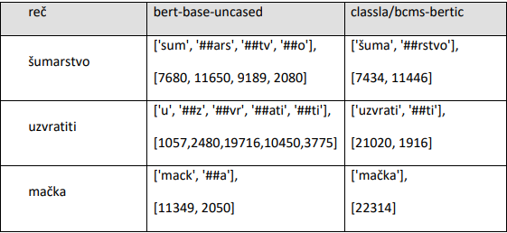
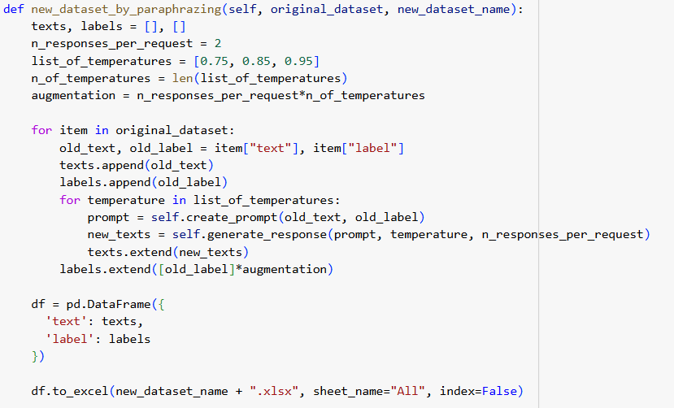
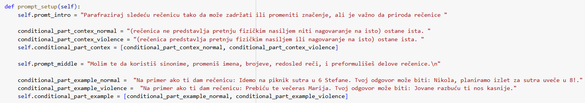
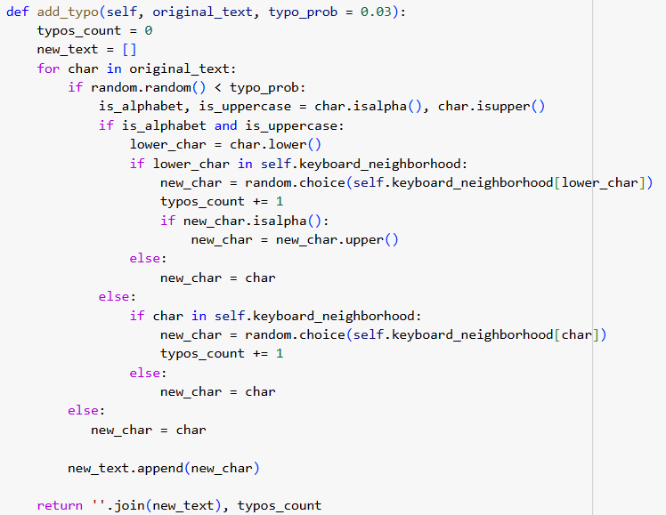
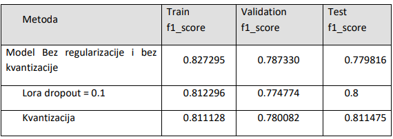
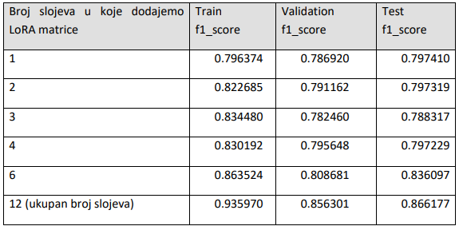
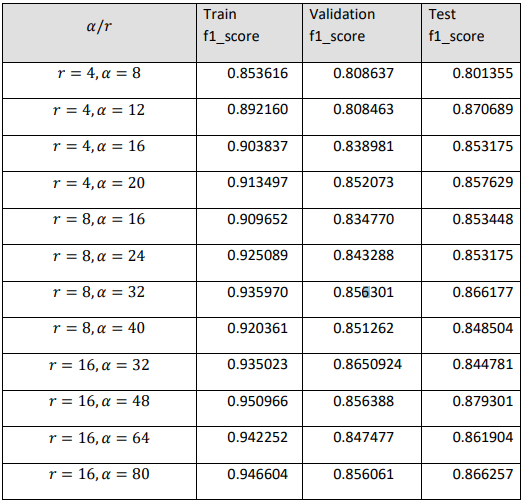
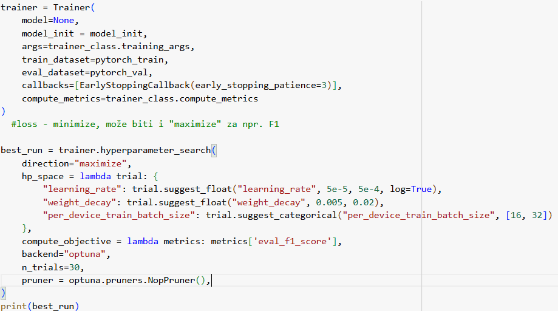
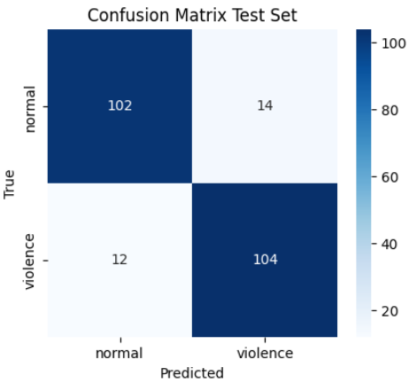

## Parametarski efikasno podešavanje jezičkog modela za detekciju pretnji fizičkim nasiljem u tekstu

Cilj ovog rada je da istraži kako modeli obrade prirodnog jezika (NLP, eng. Natural
Language Processing), zasnovani na savremenim metodama poput transformera i mehanizma
pažnje (eng. attention), mogu pomoći u prepoznavanju ’’nasilnog govora’’. Specifično u
kombinaciji sa parametarski efikasnim finim podešavanjem tehnikama LoRA (eng. Low-Rank
Adaptation of Large Language Models) i QLoRA (eng. Quantized Low-Rank Adaptation).

U ono što model treba da detektuje spadaju:
-  Pretnje fizičkim nasiljem
-  Pretnje ubistvom
-  Nagovaranje na fizičko nasilje
- Nagovaranje na samoubistvo
- Nagovaranje na samo povređivanje
  
A izuzetci koje model treba da klasifikuje kao ’’normalan govor’’:
- Pretnje samoubistvom – ideja je da ovo više poziv za pomoć nego bilo kakva pretnja
nasiljem, takođe ovde spadaju molbe za pomoć pri samoubistvo i slično
- Pretnje samopovređivanjem
Teži primeri za klasifikaciju uključuju primere vezane za:
- ’’Geming contex’’, Ovo je dodato da se zadatak oteža, model treba da prepozna da se
pretnje upućuju igračima u igrici.
- Ostali specifični kontekti poput religijskog, pravnog i slično..

# izbor modela, tokenizacija
 - upoređivanjem tokenizatora razlicitih modela odabrao sam bertic (checkpoint_name = "classla/bcms-bertic")

🐍[Tokenizatori](https://github.com/Jankoetf/Text-Classification-Death-Threats/blob/main/BertAnalysis.ipynb)

# Kreiranje dataset-a
Ručno, Parafraziranje pomoću modela GPT-4o preko OPEN API, Umetanje šuma dodavanjenje najčešćih slovnih grešaka

- Parafraziranje istog ručno kreiranog teksta za različite vrednosti temperature odgovora:

🐍[Kreiranje Dataset-a](https://github.com/Jankoetf/Text-Classification-Death-Threats/blob/main/FineTunningBertic.ipynb)

- Fino podešeni prompt za parafraziranje:

- dodavanje šuma slovnih grešaka:

# Fino podešavanje
U cilju uštede na računarskim resursima korišćena je kvantizacija i LoRA matrice za fino podešavanje, mesta na kojima su dodavane LoRA matrice kao i njihov rank je fino podešen za dodatnu uštedu resursa uz minimalni gubitak na performansama:

🐍[Fino Podešavanje](https://github.com/Jankoetf/Text-Classification-Death-Threats/blob/main/FineTunningBertic.ipynb)

- Kvantizacija kao metoda regularizacije:

- Uticaj broja slojeva na koje se dodaju LoRA matrice na performanse:

- fino podešavanje odnosa LoRA rank-a i LoRA skalirajućeg faktora

- fino podešavanje ostalih hyperparametara:

# Konačni rezultati

# Analiza sličnih modela

🐍[Facebook roBERTa](https://github.com/Jankoetf/Text-Classification-Death-Threats/blob/main/Facebook_RoBerta.ipynb)

## **Thank you for exploring my project!** 
If you'd like to learn more about my background and qualifications, please visit my [LinkedIn profile](https://www.linkedin.com/in/jankomitrovic)
